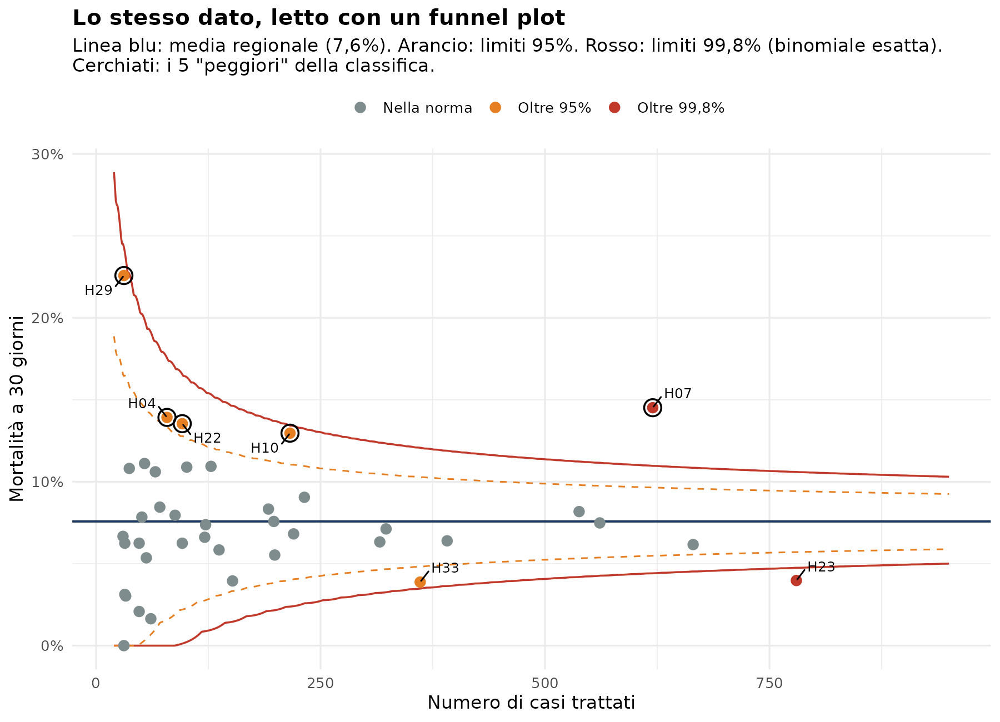

# 01 · Funnel plot per confrontare le strutture sanitarie

Script per riprodurre i grafici dell'articolo *Oltre la classifica: il funnel plot, interpretazione grafica per confrontare le strutture sanitarie*.

## Contenuto dello script

1. Simulazione di 40 ospedali con volumi diversi (mortalità a 30 giorni)
2. Classifica "tradizionale" → `01_classifica.png`
3. Funnel plot con limiti binomiali esatti al 95% e al 99,8% → `02_funnel_plot.png`
4. Versione avanzata: approssimazione normale, limiti esatti e correzione per sovradispersione → `03_funnel_avanzato.png`

## Esecuzione

```r
source("funnel_plot.R")
```

I grafici vengono salvati nella cartella di lavoro.



## Riferimenti

- Spiegelhalter DJ. Funnel plots for comparing institutional performance. *Statistics in Medicine*, 2005; 24: 1185–1202.
- Spiegelhalter DJ. Handling over-dispersion of performance indicators. *Quality and Safety in Health Care*, 2005; 14: 347–351.

*Dati simulati: non si riferiscono a strutture reali.*
